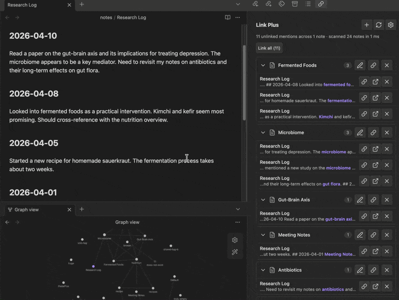
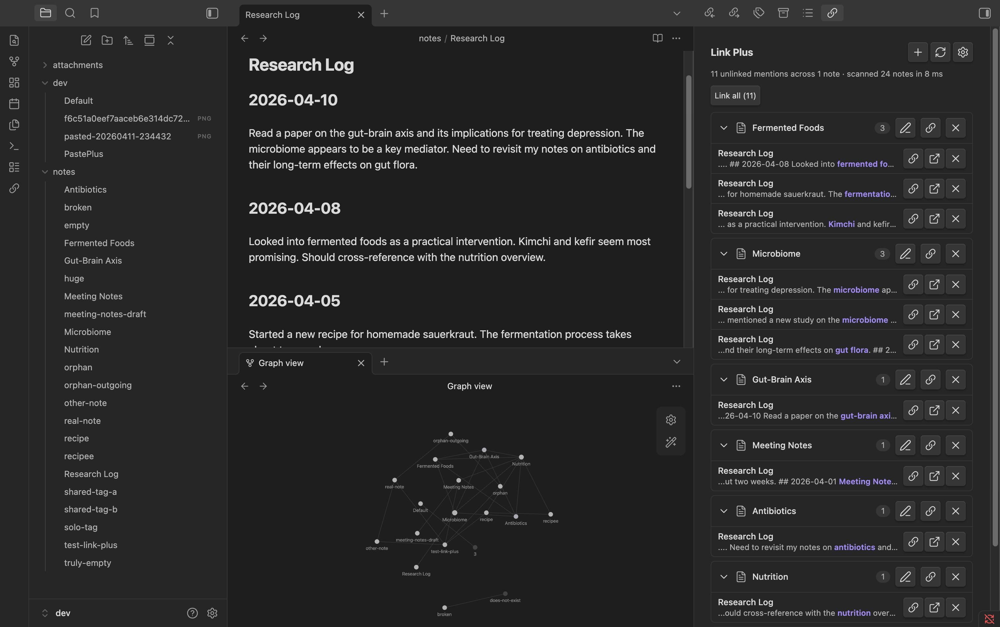
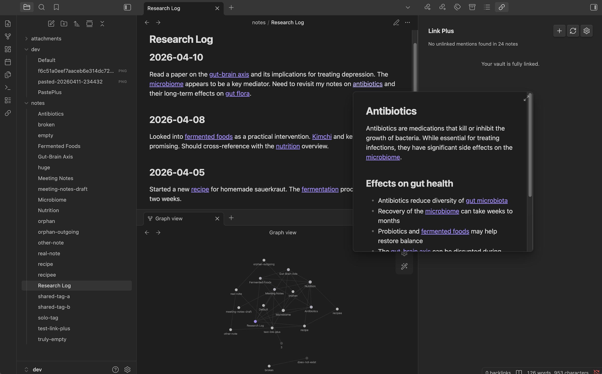

# Link Plus

Build a connected second brain in Obsidian. Find every unlinked mention in your vault and convert them to wikilinks — one click or batch. Grow your knowledge graph automatically, no setup, no learning curve.

## Before vs after

## What it does

- **Vault-wide scan** — finds every piece of text that matches a note title (or alias) but isn't linked
- **Grouped results** — mentions organized by target note, with source file and context snippet
- **One-click linking** — convert a single mention to a `[[wikilink]]` instantly
- **Batch linking** — link all mentions of a note, or every unlinked mention in the vault at once
- **Smart matching** — case-insensitive, whole-word only, respects frontmatter aliases
- **Alias management** — add or remove search aliases from the dashboard, no manual YAML editing needed
- **Ignore mentions** — dismiss individual mentions or exclude a note from results entirely
- **Skips what it should** — ignores existing links, code blocks, frontmatter, and self-references

Every setting is toggleable. Disable case-insensitive matching, exclude folders, filter out short titles — you're in control.

## Why

Obsidian's core backlinks pane shows unlinked mentions, but only for the note you're looking at, and you can't act on them. There's no vault-wide view, no batch convert, no way to see the full picture. Link Plus fills that gap — one dashboard, every unlinked mention, one-click fixes.

## Installation

### From the Obsidian community plugins directory (once approved)

1. Open Obsidian → Settings → Community plugins
2. Search for **Link Plus**
3. Click Install, then Enable

### Manual install

1. Download `main.js`, `manifest.json`, and `styles.css` from the latest release
2. Copy them into your vault at `.obsidian/plugins/link-plus/`
3. Reload Obsidian and enable the plugin under Settings → Community plugins

## Usage

- **Ribbon icon** (link) → opens the Link Plus dashboard in the right sidebar
- **Command palette** → "Link Plus: Open dashboard" or "Link Plus: Scan vault for unlinked mentions"
- Results are grouped by target note — click any group header to expand or collapse
- Each mention row shows:
  - **Source file name** (click to open the file at that line)
  - **Context snippet** with the matched text highlighted
  - **Link** — converts the mention to a wikilink
  - **Open** — opens the source file and scrolls to the mention
  - **Ignore** — dismiss this mention so it won't appear again
- Each group header has:
  - **Edit aliases** (pencil icon) — open a modal to view, add, or remove the search terms for that note
  - **Link all** — batch-convert all mentions for that note
  - **Ignore all** (x icon) — exclude that note from future scans
- **Link all** at the top converts every unlinked mention in the vault (with confirmation by default)
- **+ button** in the header — pick any note in the vault and add aliases for it, even if it has no current matches

The dashboard auto-refreshes a couple of seconds after you edit a note so results stay current while you work.

## Settings

Open **Settings → Community plugins → Link Plus**. You can:

- Toggle case-insensitive matching
- Set a minimum match length (default 3 — avoids matching "AI", "to", etc.)
- Exclude specific folders from scanning (e.g. templates, archive)
- Exclude specific note titles from matching (e.g. common words that are note titles)
- Toggle context snippets in results
- Require confirmation before batch linking
- Disable auto-rescan on vault changes
- Open the dashboard automatically on startup
- Clear all ignored mentions to reset dismissals

## How it works

Link Plus reads Obsidian's metadata cache to collect note titles and aliases — it never re-parses your markdown. Matching uses word-boundary regex so "cell" doesn't match inside "cellular". All work is local and offline, no network calls, no cloud services, no telemetry. Scans are debounced so editing doesn't thrash the dashboard, and re-scans only run while the dashboard is open.

## Performance notes

The scanner iterates each file once and tests all titles against it. Word-boundary matching with pre-compiled regex keeps things fast. For vaults up to 5,000 notes, expect scans to complete in under 2 seconds. The scanner yields to the event loop every 50 files to keep Obsidian responsive.

## Plus Plugin Family

Link Plus is part of the **Plus Plugin Family** for Obsidian:

- **[Paste Plus](https://github.com/jabaho9523/obsidian-paste-plus)** — Smart paste: URLs become titled links, images get clean filenames, HTML converts to markdown, YouTube and Twitter links resolve to titles.
- **[Vault Plus](https://github.com/jabaho9523/obsidian-vault-plus)** — Vault health dashboard: find and fix orphans, broken links, empty notes, duplicates, and more.
- **Link Plus** — Unlinked mention scanner: find and convert unlinked mentions vault-wide with one-click or batch operations.

## Support

If Link Plus saves you time, you can support development here:

## License

0BSD — take it, fork it, ship it, no strings attached.
